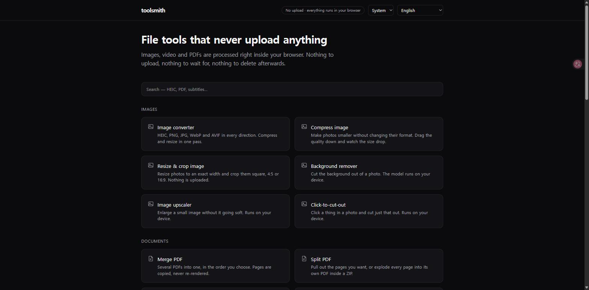

# toolsmith

File tools that don't upload your files. Images, video, audio and PDFs, all converted
inside the browser tab.

**[toolsmith.writingdeveloper.blog](https://toolsmith.writingdeveloper.blog)** ·
21 tools · 6 languages · no account, no ads, no watermark



## "Runs in your browser" is easy to say

It's become a stock phrase, so here's what's actually enforced.

There's no server to upload to. Every page is prerendered static HTML on a CDN, and
the work happens in a Web Worker in your tab. That's a property of the build rather
than a line in a privacy policy. It also means anything that genuinely needs a server
isn't here and won't be.

If you'd rather not take my word for it, all 21 tools have a test that runs a real
conversion with request interception on and fails if an outbound POST or PUT contains
any part of the input file. Or just open the network tab.

Models are the one thing downloaded, and they come to you rather than the other way
round: they're fetched from the Hugging Face CDN, and only once you press the button.

Most browser-only tool sites stop at documents and images. Video here runs on
WebCodecs, so MOV to MP4 is a remux with no re-encode, and eight tools run real models
locally: background removal, upscaling, click-to-cut-out, subtitles, subtitle
translation, stem separation, summarization and OCR.

## Three things that cost the most time

### `@ffmpeg/core` is GPL, and shipping it to a browser is distribution

Its wasm binary is built with `--enable-gpl --enable-libx264 --enable-libx265`.
Sending 30.7 MB of that to a visitor is distribution, which makes the whole site GPL.
Most "convert video in your browser" tutorials skip past this.

So WebCodecs instead. It's built into the browser, costs nothing to download, and runs
on hardware. Only the containers are ours: `mp4box.js` (BSD-3) to demux, `mp4-muxer`
and `webm-muxer` (MIT) to mux. MOV to MP4 turned into a straight remux, which is
lossless and close to instant.

### Portrait video came out sideways in four tools, and every test was green

Phones store portrait video as landscape pixels plus a rotation matrix in the `tkhd`
box. I wasn't reading it, so convert, trim, compress and GIF all produced sideways
output.

The tests passed because every video fixture I had was landscape. That isn't a bug
that slipped through review, it's a hole in the sample set, which is a different
problem and a harder one to notice.

Verifying the fix was worse than writing it. Matching dimensions prove nothing about
orientation, since 180° preserves them and 90°/270° are indistinguishable by size
alone. And the four rotated files each had to be compared against their own source
rather than against each other. The fix splits by output too: MP4 rewrites the matrix,
while WebM and GIF have to bake the rotation into pixels.

### A clean license doesn't make a model usable

Choosing on-device models turned into five gates, in this order: exists, license,
size, speed, quality. Every one of them killed a candidate that was already written
into the plan.

- **Exists.** A well-cited comparison table pointed at a model that doesn't exist.
- **License.** Kokoro TTS has genuinely clean weights, but its grapheme-to-phoneme
  step bundles a compiled eSpeak NG (GPL-3.0). The license gate covers everything the
  model needs in order to run, not just the weights. Spleeter was the third "code is
  MIT, weights aren't" case.
- **Quality.** Two Apache-2.0 summarizers copied the input back instead of summarizing
  it. A clean license is worth nothing if the model can't do the job.

Runtime versions can flip a verdict too. Subtitle translation only works on
transformers.js 3.7.6, and summarization only works on 4.2.0. Unifying them kills one
of the two, quietly.

The rest of it, including every rejected candidate and every measurement, is in
[`docs/TOOLS.md`](docs/TOOLS.md). That file is in Korean.

## What it does

| | |
|---|---|
| **Images** | convert (incl. HEIC), compress, resize/crop |
| **PDF** | merge, split, rotate/delete pages, compress (re-encodes JPEGs only, so text stays text) |
| **Video** | convert, compress, trim, extract audio, to GIF |
| **On-device models** | background removal, upscaling, click-to-cut-out, subtitles, subtitle translation, stem separation, summarization, OCR |
| **Data** | SQL over CSV/Parquet with DuckDB-wasm; the file is passed as a handle, never read into memory |

Results chain between tools. Finish in one and hand the output straight to the next;
the blob travels through IndexedDB and is deleted the moment it's claimed.

## Browser support

Capability is detected at runtime instead of sniffed from the user agent, so if your
browser can't encode WebM or reach WebGPU, the tool says so up front rather than
failing halfway through. Chrome and Edge cover everything. Safari and Firefox vary by
feature, mostly around video. Summarization needs WebGPU and has nothing to fall back
to, so it's desktop-only.

## Stack

- Next.js 16 (App Router, Turbopack), TypeScript in strict mode, Tailwind 4
- Fully static: 235 prerendered pages, no server compute, no middleware
- Processing: Web Workers plus `OffscreenCanvas` / WASM / WebCodecs / WebGPU
- ONNX Runtime Web is loaded from a CDN and deliberately isn't an npm dependency. Its
  default export embeds the wasm as base64, so importing it ships about 20 MB from
  your own host.
- 411 Playwright specs across two projects, one of which forces the WebGPU path

## Development

```bash
pnpm install
pnpm dev        # http://localhost:3000
pnpm build      # includes typecheck
pnpm test       # Playwright; starts its own dev server
pnpm fixtures   # regenerate tests/fixtures
```

Specs check decoded output rather than UI text: magic bytes, actual pixel values,
output dimensions. The word "converted" appearing on screen proves nothing.

## Layout

```
app/
  (root)/page.tsx        "/" language picker, static, no redirect
  [locale]/
    layout.tsx           <html lang>, header/footer, hreflang
    page.tsx             home; tool grid driven by lib/tools.ts
    tools/<slug>/        page.tsx (server) + <Tool>.tsx ('use client') + *.worker.ts
    guides/ lab/
lib/
  tools.ts               tool registry
  i18n/                  en is the type source; the other five are enforced by `satisfies`
  image/ pdf/ video/     pure processing modules; never touch window or document
  onnx/runtime.ts        the only place a model runtime is opened
  segment/ upscale/ subtitles/ translate/ stems/ summarize/ ocr/ pii/
  handoff.ts             the only path a result takes from one tool to the next
tests/                   Playwright specs and fixtures
docs/TOOLS.md            master log (Korean)
```

## Known gaps

- **AVIF encoding** is unverified. The test Chromium doesn't support it, so it drops
  off the capability list automatically.
- **Safari's native HEIC path** is unverified. Chrome's libheif path was checked with
  real iPhone photos.
- **Summarization needs WebGPU** with no fallback: the wasm execution provider has no
  implementation of the operators that export uses.
- Animated GIFs keep only the first frame when converted. The UI says so before you
  start.

## Status

Feature-complete and frozen as of 2026-08-12. All 21 planned tools shipped. I'm not
adding more tools, languages or guides. Bug fixes and dependency updates continue.

The short version of why: building was never the constraint here, distribution is, and
a 22nd tool doesn't change that. The long version, with the numbers behind it, is in
[`docs/TOOLS.md`](docs/TOOLS.md).

Issues and PRs are welcome. Treat the roadmap as closed.

## License

MIT, see [`LICENSE`](LICENSE).

Third-party models are downloaded at runtime from the Hugging Face CDN under their own
licenses (Apache-2.0, BSD-3, MIT). No copyleft dependency is used anywhere, by rule.
